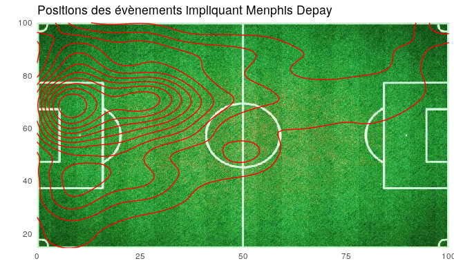

```{r setup, include=FALSE}
knitr::opts_chunk$set(echo = FALSE)
```

## Données et sources d'information

<ul>
<li> [Données](https://figshare.com/collections/Soccer_match_event_dataset/4415000/2)
<li> [Article](https://www.nature.com/articles/s41597-019-0247-7)
<li> [Api doc](https://apidocs.wyscout.com/)
</ul>

## Sujets

Pour les matchs du championat de france, construire une table contenant:
<ul>
<li> eventype "factor"
<li> subeventype "factor"
<li> time (seconde depuis le début du match = temps dernier evt 1er+temps 2nd) "int"
<li> x1 "int"
<li> y1 "int"
<li> x2 "int"
<li> y2 "int"
<li> matchid "int"
<li> playername (FirstName LastName) "character"
<li> playerteam "factor"
<li> playerrole "factor"
<li> playerfoot "factor"
</ul>

## Sujets

Pour les matchs du championat de france, construire une table contenant:
<ul>
<li> previous(next)_eventtype "factor"
<li> previous(next)_subeventype "factor"
<li> previous(next)_time (seconde depuis le début du match) "int"
<li> previous(next)_x1 "int"
<li> previous(next)_y1 "int"
<li> previous(next)_x2 "int"
<li> previous(next)_y2 "int"
<li> previous(next)_playername (FirstName LastName) "character"
<li> previous(next)_playerteam "character"
<li> goal, owngoal, interception, red_card,accurate,not_accurate (booleans) see tags
</ul>


## <span class="red">Analyse exploratoire</span>  {data-background=#ffffff}
<span style="color:#000">Proposer des visualisation analyse du jeu de données construit</span>

